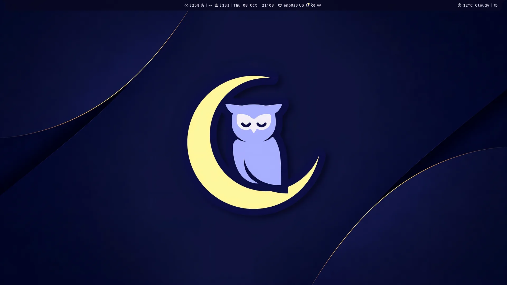
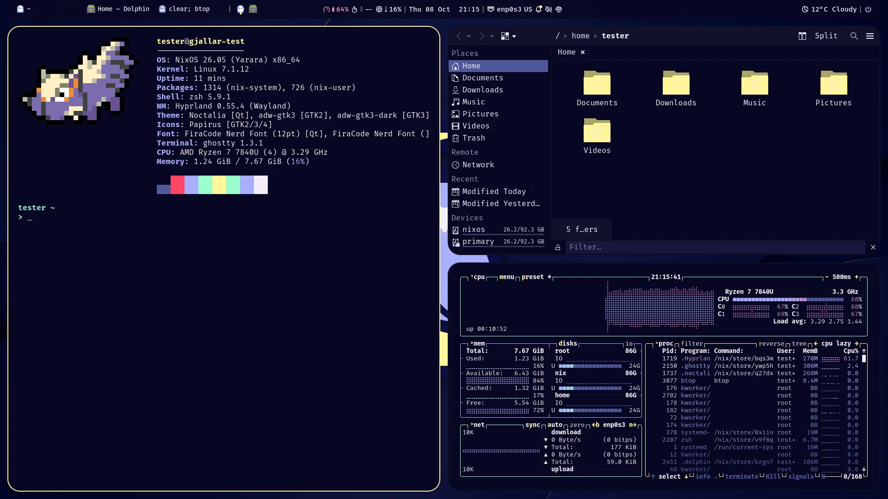
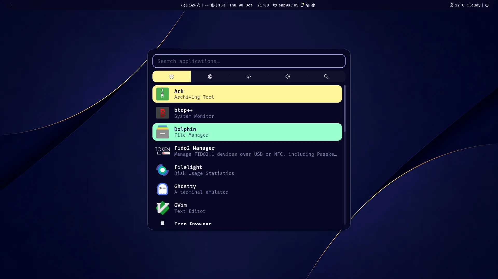
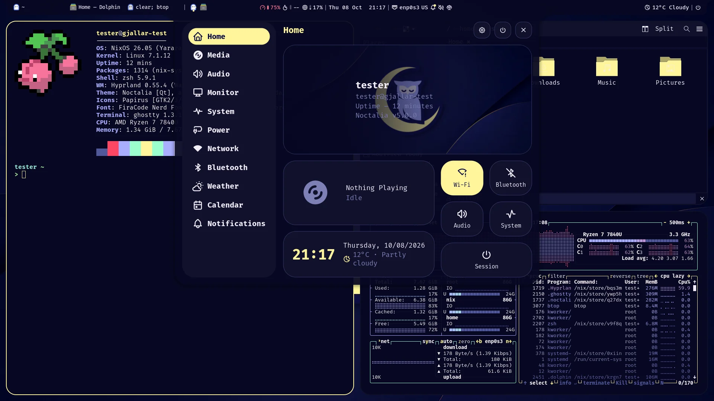
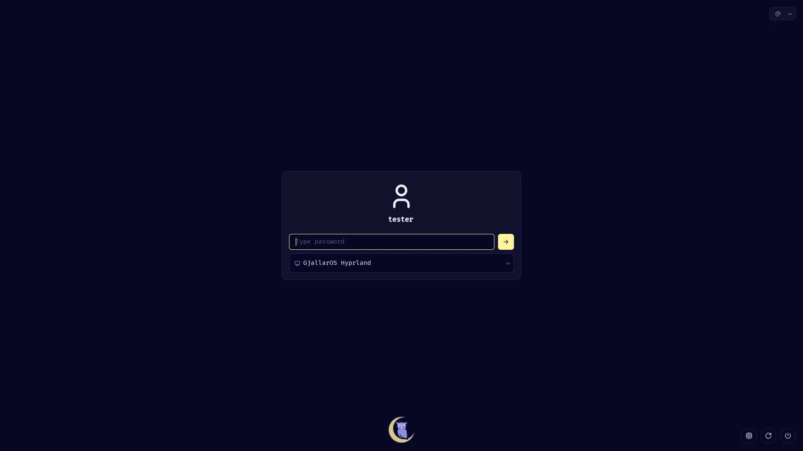
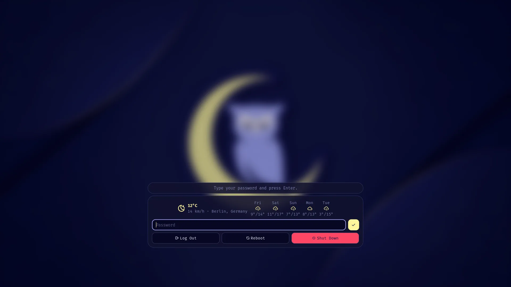
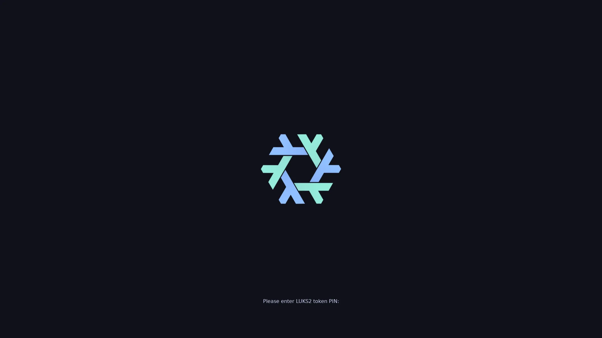

<div align="center">


# GjallarOS

**A secure, modular NixOS workstation on Hyprland.**

NixOS 26.05 · Hyprland · Noctalia · ODDC hardware policy · TPM2 disk encryption · reviewable installer

<br>

<a href="#-quick-start"><kbd> <br> Quick start <br> </kbd></a>&ensp;
<a href="#-screenshots"><kbd> <br> Screenshots <br> </kbd></a>&ensp;
<a href="#features"><kbd> <br> Features <br> </kbd></a>&ensp;
<a href="#%EF%B8%8F-keybindings"><kbd> <br> Keybindings <br> </kbd></a>&ensp;
<a href="#-configuration"><kbd> <br> Configuration <br> </kbd></a>&ensp;
<a href="#-license"><kbd> <br> License <br> </kbd></a>

<br><br>



</div>

<br>

## 🚀 Quick start

Needs a machine booted in UEFI mode (legacy BIOS/CSM is refused). On NixOS,
or the NixOS minimal ISO:

```bash
curl -fsSL https://raw.githubusercontent.com/JadeOpenServices/gjallarOS/main/scripts/installation/install.sh | bash
```

The script clones the repository with its submodules into
`~/Documents/gjallarOS` (set `GJALLAR_DIR` to change it) and starts the
interactive installer from that checkout. Re-running it reuses the checkout.
`GJALLAR_CLONE_ONLY=1` stops after the clone. From an existing checkout,
run `./scripts/installation/install.sh` directly.

For automated non-secret answers:

```bash
cp scripts/installation/user_PresetJSON/default.user.config.json user.config.json
```

Edit the copy, then run the installer. Secrets, LUKS passphrases, recovery
settings, generated hardware data and backups are excluded from Git.

> [!TIP]
> After the install, apply every change with `rebuild`, not
> `sudo nixos-rebuild switch --flake`. See
> [Rebuilds and removable disks](#-rebuilds-and-removable-disks).

<div align="right"><a href="#gjallaros">↑ back to top</a></div>

## 📸 Screenshots

<div align="center">
<table>
  <tr>
    <td colspan="2"></td>
  </tr>
  <tr>
    <td width="50%"></td>
    <td width="50%"></td>
  </tr>
  <tr>
    <td width="50%"></td>
    <td width="50%"></td>
  </tr>
  <tr>
    <td colspan="2" align="center"></td>
  </tr>
</table>

<sub>Tiling · launcher · control center · greeter · lock screen · TPM2+PIN disk unlock at boot.<br>
Taken in a QEMU test VM at 1920×1080.</sub>
</div>

<div align="right"><a href="#gjallaros">↑ back to top</a></div>

## Features

| | |
| --- | --- |
| **Desktop** | Hyprland-only, Home Manager user configuration, Noctalia shell, Stylix theming propagated to system apps. |
| **Disk encryption** | LUKS2 with TPM2 enrollment, optional TPM+PIN, recovery-key handling, SOPS/age secrets. |
| **Hardware policy** | [ODDC](https://github.com/JadeOpenServices/oddc)-backed device identity and capabilities; graphics, Wi-Fi, firmware, touchscreen, battery and clamshell detection. |
| **USB trust** | Review new USB devices, TPM-signed permanent trust, opt-in enforcement. |
| **VPN and network trust** | Tailscale with per-network trust levels and automatic exit nodes. |
| **App catalogue** | One list in `user.config.json` picks the apps; each app owns its whole module. |
| **Local AI** | Optional localhost-only Ollama with hardware-aware model selection, or a central HTTPS server with a sealed token. |
| **Recovery** | Trusted recovery boot entry, recovery ISO, generation rollback without deleting anything newer. |
| **Apps** | VSCodium, web apps (Teams, Plane, draw.io), system-wide Wine, optional Nemu. |
| **Maintenance** | Helpers for rebuilding, cleanup, thermal status, and updates. |

<details>
<summary><b>Local AI details</b></summary>
<br>

AI is optional and localhost-only, with hardware-aware model selection. On AMD
integrated graphics it runs on Vulkan instead of ROCm, and it is confined
below the desktop (memory capped at 65% of RAM, low CPU/IO priority, killed
first under memory pressure) so a model load cannot take Hyprland down.

Instead of a local model, AI can use a central server: set `aiEndpoint`
(`https://host[:port]` only), `aiRemoteModel` and `aiRemoteContextTokens`.
The server must sit behind HTTPS and check a bearer token (Ollama itself has
no login); http endpoints and missing tokens are refused. The installer asks
for the token hidden; on an installed system run `gjallarctl ai set-token`.
The token never enters the Nix store or `user.config.json`: it is encrypted
with `systemd-creds` (TPM2-bound when present) into
`/var/lib/gjallarOS/ai/endpoint-token.cred`.

</details>

<div align="right"><a href="#gjallaros">↑ back to top</a></div>

## ⌨️ Keybindings

`$mod` is the Super key. The full list lives in
[`user/wm/hyprland/keybinds.json`](user/wm/hyprland/keybinds.json).

| Keys | Action |
| --- | --- |
| <kbd>Super</kbd> + <kbd>D</kbd> | Application launcher |
| <kbd>Super</kbd> + <kbd>T</kbd> | Terminal (Ghostty) |
| <kbd>Super</kbd> + <kbd>F</kbd> | File manager (Dolphin) |
| <kbd>Super</kbd> + <kbd>E</kbd> | Editor |
| <kbd>Super</kbd> + <kbd>B</kbd> | Browser |
| <kbd>Super</kbd> + <kbd>Q</kbd> | Close window |
| <kbd>Super</kbd> + <kbd>W</kbd> | Fullscreen |
| <kbd>Super</kbd> + <kbd>H</kbd> <kbd>J</kbd> <kbd>K</kbd> <kbd>L</kbd> | Move focus |
| <kbd>Super</kbd> + <kbd>Shift</kbd> + <kbd>H</kbd> <kbd>J</kbd> <kbd>K</kbd> <kbd>L</kbd> | Move window |
| <kbd>Super</kbd> + <kbd>Ctrl</kbd> + arrow keys | Resize window (hold to repeat) |
| Drag the gap between windows | Resize window (or <kbd>Super</kbd> + right-drag) |
| <kbd>Super</kbd> + <kbd>1</kbd>…<kbd>0</kbd> | Switch workspace |
| <kbd>Super</kbd> + <kbd>Shift</kbd> + <kbd>1</kbd>…<kbd>0</kbd> | Move window to workspace |
| <kbd>Super</kbd> + <kbd>S</kbd> | Scratchpad workspace |
| <kbd>Super</kbd> + <kbd>Shift</kbd> + <kbd>Z</kbd> | Screenshot region |
| <kbd>Super</kbd> + <kbd>Escape</kbd> | Lock screen |

<div align="right"><a href="#gjallaros">↑ back to top</a></div>

## 🔧 Configuration

`user.config.json` contains machine-local human intent. The installer normalizes
that intent into `generated/state.nix`; machine hardware lives in
`generated/hardware.nix`, and historical compatibility baselines live in
`generated/install-state.nix`. `deployment/release-policy.json` records the supported release. The
root flake, Home Manager, and Stylix follow 26.05; only the ComfyUI
development shell intentionally uses unstable.

Web apps are listed in `webApplications`, for example
`[{"id": "teams"}, {"id": "plane", "endpoint": "https://plane.example"}]`.
The older `planeEnable`/`planeHost`/`drawio*` fields are still read when
`webApplications` is absent, but new configs should use the list.

### App catalogue

Optional applications live in `apps/<id>/`: `meta.json` (name, description,
category, `default`, optional `installer` question), and a `home.nix` and/or
`nixos.nix` module. Each app owns its whole module, so removing an app removes
everything it brought in.

`user.config.json` selects apps with one list:

```json
"apps": ["ai", "btop", "containers", "dolphin", "tailscale"]
```

Without `apps`, every app with `"default": true` is installed. The installer
asks each app's `installer` question (today `ai`, `containers`, `nemu`,
`tailscale`) and uses `default` for the rest. `apps` drives
`gjallar.apps.<id>.enable` on both the NixOS side (`apps/nixos-options.nix`)
and the Home Manager side (`user/apps/default.nix`). The old `aiEnable`,
`containersEnable` and `nemuEnable` keys are rejected; list `ai`,
`containers` or `nemu` in `apps` instead.

<div align="right"><a href="#gjallaros">↑ back to top</a></div>

## 🧬 Hardware catalog (ODDC)

[ODDC](https://github.com/JadeOpenServices/oddc) is a separate project,
used like an API. The installer reads the machine's DMI identity and asks ODDC
for its model; only that model's answer (referenced entities, evidence and the
ODDC revision) lands in `generated/oddc`. Nothing else of the catalog reaches
this repository or the machine. The `oddc` flake input supplies module code
only, and the system configuration reads the answer as `oddc.catalog`. The
installed system receives that model under `/etc/oddc`.

The answer comes from the ODDC commit `flake.lock` pins for the `oddc` input.
Updating ODDC on a device is one operation:

```bash
gjallarctl oddc update --rebuild
```

<details>
<summary><b>How ODDC updates work</b></summary>
<br>

`gjallarctl oddc update --rebuild` runs `nix flake update oddc` on the
system's checkout and rebuilds, then says whether ODDC moved
(`ODDC: OLD -> NEW` or `ODDC: already at REV`) and where this machine's answer
stands. `--simple` prints only that as one line; `--debug` lists the lock and
answer revisions before and after, the model, and whether the answer was
fetched, kept or left unchanged. When the pinned commit differs from
`generated/oddc/revision`, the rebuild fetches the same model again at the new
commit and swaps it in only once complete. Offline, the rebuild warns and
keeps the answer it has. Without `--rebuild`, the next `rebuild` does the
fetch. `gjallarctl oddc doctor` shows the ODDC revision the installed model
came from.

`rebuild --hardware-update [--stage main|staging] [--switch 0|1]` does the
same move as part of a rebuild: it runs `oddc update --flake <checkout>
[--stage STAGE]` first and stops with `nothing rebuilt` if that fails.
`--stage` moves the oddc input to the newest commit of that branch; no commit
hash is needed. `--switch 1` (the default) rebuilds and switches right away;
`--switch 0` only moves the pin, and the next `rebuild` applies it. It needs an
`oddc` that knows `update --flake`. Always apply with `rebuild`, not `sudo
nixos-rebuild switch --flake`: `generated/` is untracked, so a plain git flake
cannot see it.

A plain `rebuild` never moves the pin. It asks GitHub whether the branch the
oddc input follows has a newer commit and, if so, prints `ODDC update
available: OLD -> NEW. Apply with: rebuild --hardware-update`. Offline or on
any error it says nothing. Managed endpoints skip the check: JODS moves their
pin.

`gjallarctl oddc COMMAND` passes ODDC commands to `oddc` unchanged, for example
`gjallarctl oddc resolve` or `gjallarctl oddc explain --path PATH`. On the
installed system these default to its model. `gjallarctl oddc validate-device`
validates this checkout on the device. Validation evidence goes to ODDC through
`oddc contribute`, not into this repository.

</details>

<div align="right"><a href="#gjallaros">↑ back to top</a></div>

## 💾 Rebuilds and removable disks

Every GjallarOS system names its checkout in `/etc/gjallar/repository`
(`dotfilesDir`), so `rebuild`, `gjallarctl oddc update` and the other commands
find it from any directory. `--repo PATH`, `GJALLAROS_REPO` and the checkout you
last rebuilt from take precedence. Direct host flake builds fail unless the
source was staged by `gjallarctl`; installer and recovery deployment also use
that staging path. This prevents skipping the normal preparation workflow. It
is not an authorization boundary against root or someone who can change the
source. Package builds and recovery ISO builds remain available directly.

To bring an install up to date with upstream, run:

```bash
rebuild --update
```

It runs `git pull --ff-only` in that checkout and then rebuilds. Local
commits or uncommitted edits stop the pull, and nothing is rebuilt.
`rebuild --update-inputs` moves every flake input first (for development
checkouts). `rebuild --help` lists every option.

To try a `gjallarctl` change before rebuilding, run it from the checkout with
`go run ./cmd/gjallarctl rebuild` (or any other command). It uses the sudo
helpers of the installed system, so this works only on a machine that already
runs GjallarOS. If you need the package itself, build it with
`nix build "git+file://$PWD#gjallarctl"`. A `path:` flake reference copies the
whole directory into the Nix store, untracked files and VM disks included.

### Recovery and rollback

With `recoveryEnable`, the boot menu lists only the newest generation and its
recovery entries. To boot an older generation, start trusted recovery (or the
recovery ISO, with the root mounted at `/mnt`) and run:

```bash
sudo gjallar-recover generations /
sudo gjallar-recover rollback / N
```

This adds a new generation with that system; nothing newer is deleted.

> [!NOTE]
> The installed system does not carry the installer. `gjallar-installer` and
> `gjallar-recovery-maintenance` (package `pkgs/gjallar-installer`) can
> repartition and reinstall a disk, so they exist only in the trusted-recovery
> boot entry, the recovery-maintenance initrd and the recovery ISO. A reinstall
> or reset therefore needs a deliberate boot into recovery.

### USB trust

USB review offers permanent trust after a configured, unused TPM signing handle
has been provisioned with `sudo gjallarctl usb provision-key`. Existing TPM
objects are never overwritten. Provisioning does not automatically trust devices
or enable enforcement; inspect `gjallarctl usb status` and review devices first.

Enforcement is turned on with `"usbTrustEnforce": true` in `user.config.json`
and a `rebuild`. To turn it off, set it back to `false`, `rebuild`, then run
`sudo gjallarctl usb disarm` and enter the disk encryption passphrase. Disarm
alone is temporary: the broker re-arms from the config on its next restart.

Unformatted USB disks offer an explicit exFAT setup prompt. Cancelling leaves the
disk unchanged. Existing partitions, recognized filesystems, mounted devices,
and readers with no media are excluded. Formatting uses UDisks/Polkit and
requires confirmation; lack of a recognized filesystem does not prove a disk
contains no valuable data.

<div align="right"><a href="#gjallaros">↑ back to top</a></div>

## 🛡️ Tailscale VPN and network trust

The installer can enable Tailscale and use a tailnet exit node as VPN.
`gjallar-vpn-trust` then decides on every network change, tailnet change, and
every five minutes how far to trust the current network:

| Network | Recognized by | Local subnets | Exit node |
| --- | --- | --- | --- |
| home | a home subnet, proven by a trusted Wi-Fi name or your tailnet router answering on it | home subnets | off |
| site | `siteRouterTrust`: a tailnet subnet router on this LAN that reaches every `siteRouterTargets` host | this LAN | off |
| trusted-wifi | a `trustedWifis` name on a network that needs a key | this LAN | off, or its `wifiExitNodes` entry |
| untrusted | anything else | none | `exitNode` |
| offline | no default route | none | unchanged |

> [!WARNING]
> A trusted name on an open network only produces a warning, since anyone can
> clone it.

`exitNode` is a tailnet host name or 100.x address; `auto` picks an
online exit node, preferring one that routes a home subnet; `off` keeps it off
everywhere; empty leaves the exit node to you unless `wifiExitNodes` is set.
LAN access stays on while an exit node is active so captive portals and
printers keep working. DNS then goes to the exit node, so a home router's
filtering also applies away from home unless the tailnet's admin console
overrides DNS. `gjallarctl vpn status` shows the current decision.

<details>
<summary><b>Change trust at runtime</b></summary>
<br>

As root:

```bash
gjallarctl vpn trust-wifi                       # the current Wi-Fi
gjallarctl vpn trust-wifi "Shi 2,4" --exit-node OpenWrt   # trusted LAN, internet via OpenWrt
gjallarctl vpn trust-wifi "Shi 2,4" --exit-node default   # trusted LAN, exit node off
gjallarctl vpn untrust-wifi "Shi 2,4"
gjallarctl vpn exit-node auto                   # or off, NAME, default
```

Changes apply at once and are kept in `/var/lib/gjallar/vpn-trust-override.json`,
layered over the built-in policy in `/etc/gjallar/vpn-trust.json`, so they
survive rebuilds. To make them permanent, replace the `tailscale = { ... };`
line in `generated/state.nix` with the output of `gjallarctl vpn export`,
rebuild, then delete the override file.

</details>

<div align="right"><a href="#gjallaros">↑ back to top</a></div>

## 💜 Credits

GjallarOS builds on the ideas and groundwork of
[AlfheimOS](https://github.com/Serpentian/AlfheimOS). Please send some love
their way as well.

The desktop shell, greeter and default owl wallpaper come from
[Noctalia](https://github.com/noctalia-dev/noctalia). The README layout
takes inspiration from [HyDE](https://github.com/HyDE-Project/HyDE).

## 📜 License

GjallarOS is licensed under the GNU Affero General Public License v3.0 or
later; see [LICENSE](LICENSE). Bundled parts keep their own licenses:

- [`pkgs/monique`](https://github.com/vardstein/monique): GPL-3.0.
- [`apps/nemu/module.nix`](apps/nemu/module.nix): nemu's upstream NixOS
  module, BSD-2-Clause, license text in the file header.

<div align="right"><a href="#gjallaros">↑ back to top</a></div>
