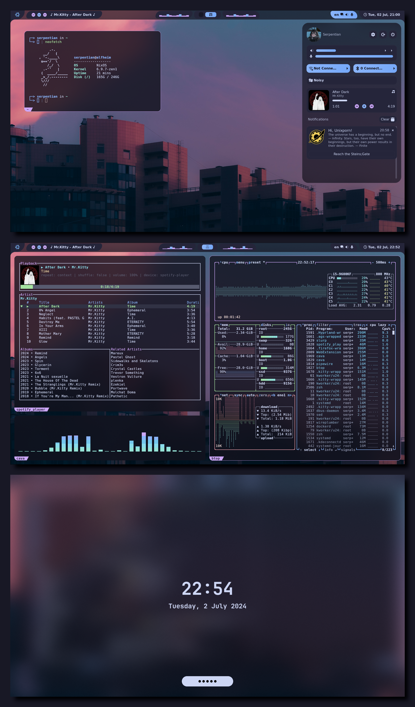
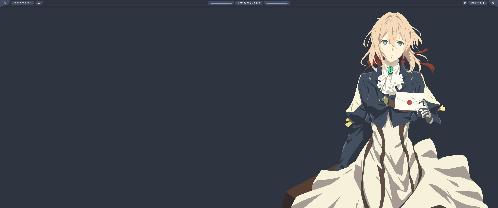
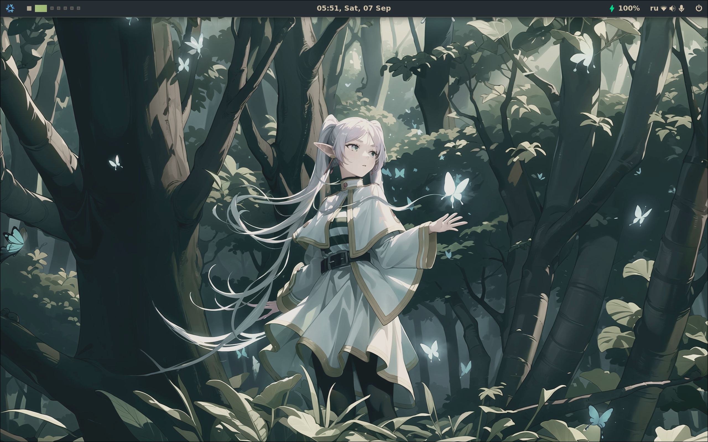

<h2 align="center">❄️  AlfheimOS ❄️ </h2>

<p align="center">
  
</p>

<p align="center">
    <a href="https://nixos.org/">
        </a>
</p>


This repository is home to the Nix code that builds my systems. Issues, PRs
and questions are welcome!

## Modules

The config is modular; you can specify settings inside [`flake.nix`](./flake.nix) and/or
exclude/include some modules inside profiles directory with:

```nix
imports = [
    ./import1.nix
    ./import2.nix
    ...
];
```

## Profiles

The configuration is separated into several profiles:
* Personal - personal laptop/desktop
* Work - work laptop (included in the Personal profile, as I work from home)

Each profile contains a `configuration.nix` for system-level configuration and a
`home.nix` for user-level configuration. Setting the `profile` variable in
[`flake.nix`](./flake.nix) automatically sources the correct `configuration.nix` and `home.nix`.

## Install

The installer is intended for an already-installed NixOS system. Clone the
repository, then run the wizard:

```bash
git clone <your-repository-url> ~/.dotfiles
cd ~/.dotfiles
./scripts/installation/install.sh
```

The wizard asks for every value in `settings.nix`, discovers the modules
available in this checkout, writes your choices, and offers to generate a
hardware configuration and apply the system with `nixos-rebuild`.

This checkout targets NixOS 26.05. The installer refuses to run on another
release, and the flake follows the matching `nixos-26.05` channel. Updates
are intentionally review-and-lock: refresh `flake.lock` as a deliberate
change instead of silently mixing package generations. `deployment/release-policy.json`
is the stable hand-off point for a future endpoint that can select release
profiles for groups of machines.

A small compatibility module keeps the pinned 26.05 NixOS options compatible
with newer Stylix theme targets; this avoids mixing OS releases while keeping
the full flake evaluation clean.

The resulting system enables the fwupd daemon, so `fwupdmgr` is ready for
firmware updates after the rebuild.

For LUKS systems, the installer can also enroll TPM2-backed automatic unlock.
This is optional, keeps the existing passphrase as recovery, and may request
that recovery passphrase after firmware or boot-chain changes.

Before detection it checks for useful bootstrap tools such as `pciutils`,
`git`, and `fwupd`. Missing packages are shown in a confirmation summary;
approved packages are added to `/etc/nixos/configuration.nix` (with a backup)
and activated with `nixos-rebuild`.

At the start it can create a separate companion work account (default name
`<user>-corp`). That account gets its own Home Manager profile based on the
work profile, with gaming modules omitted while retaining the exact same
system-wide Wine/Win11 environment for required Windows applications. Apply it with
`home-manager switch --flake .#<user>-corp` after the system rebuild.

Use `--no-rebuild` to configure without applying changes, or
`--skip-hardware` if hardware configuration is managed separately. Existing
hardware files are backed up before being replaced.

The wizard also offers optional Last.fm/ListenBrainz scrobbling. If enabled,
it encrypts the credentials with your age key. When LUKS is detected, it
verifies the current key and offers a confirmed key rotation; declining keeps
the existing key unchanged.

The Home Manager setup also provides a Microsoft Teams Edge app. Teams links
open a small chooser for Teams or the normal browser, while other links use
your configured browser directly.

Choosing `vscodium` in the installer adds the VSCodium editor, development
extensions, and focused search/file-watcher settings that keep build and
dependency trees out of indexing and AI context.

For Framework laptops, the installer offers model-specific profiles for the
Framework 13, 16, and 12. Selecting one enables its fan curve and battery
threshold configuration; other hardware does not receive those services.

Graphics and Wi-Fi are detected during installation, so AMD, Intel, NVIDIA,
and common laptop wireless hardware receive appropriate drivers and firmware
without enabling vendor-specific packages on unrelated machines.

Hyprland’s regular mouse, media, launcher, window, and workspace bindings
live in [`user/wm/hyprland/keybinds.json`](./user/wm/hyprland/keybinds.json).
Edit that file to change defaults; the Nix module resolves shell-specific
commands automatically.

Laptop power handling uses suspend-to-RAM for an undocked closed lid and keeps
the session awake when docked or connected to external power. A short power
button press suspends; holding it powers off. The fprintd service is enabled,
and the first graphical login offers fingerprint enrollment when a sensor is
actually present. Hyprland touchpad swipe gestures are enabled by default.

Wine is installed system-wide as one current WoW64 staging environment. Use
`wine-win11-init` once to create a Windows 11-style prefix with DXVK/VKD3D,
then launch programs with `wine-win11 ./program.exe`. NTFS tools and Vulkan
drivers are included. On ARM systems, FEX-Emu is added when the selected
Nixpkgs revision provides it; FEX translates x86 binaries and complements
Wine rather than replacing it. No Windows application can be guaranteed to
work perfectly, but this avoids the common duplicate-runtime and renderer
configuration problems.

Nemu is opt-in. If enabled, the installer can detect a dedicated GPU and
prepare IOMMU/VFIO kernel support, writing the PCI IDs to
`/etc/nemu/gpu-passthrough.conf`. Passing a GPU removes it from the host, so
the installer requires an explicit confirmation; the device still needs to
be attached to the chosen Nemu VM.

After the first system rebuild, Home Manager can be applied with:

```bash
cd ~/.dotfiles
home-manager switch --flake .
```

## Themes






